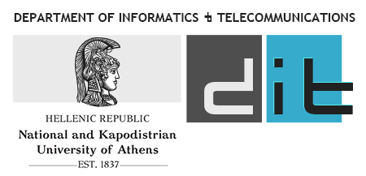

# 
Object Oriented Programming - Role Playing Game - Winter Semester 2020-2021

Professor in charge: Izambo Karali
 

## Team Personal Data:
- [George Mouratos](https://github.com/mouratos41)
- [Christina Papasotiri](https://github.com/cpapasotiri)

## Role Playing Game
### World
The game contains items, spells, heroes and monsters.  
The heroes and monsters live in a world that represented by a grid.   
The heroes can engage in battles with monsters, where they can fight against the monsters, and the heroes can fight against each other.  
Heroes can use items and spells to defeat the monsters, or they can buy items to help them on their adventure.  
Every time the heroes defeat a monster, they collect some money and gain experience. When they gain enough experience, the heroes "level up" one level, which means they become stronger in their individual abilities.

### Game Creation
The approach we followed to create this game was to start with the living beings, objects and grid squares in order to connect them in such a way that the player, using simple words and numbers, could play this game.

### Objects and Living Beings in this world:
27 livings: (9 Hero => 3 Warrior, 3 Sorcerer, 3 Paladin, 18 Monster => 6 Dragon, 6 Exoskeleton, 6 Spirit)  
120 weapons => 2/level  
80 armors => 1/level  
30 spells => Ice, Fire, Light => 1/level  
6 potions => 2 health, 2 magicPower, dexterity, strength   

### We emphasize that:
- When the world appears the team is represented graphically as * . 
- The graphical representation of the world which is also displayed on the command line is also availiable in Grid.pdf file.
- For the game to work properly the player must not choose the same hero more than once at the beginning.
- Each level of player interface gives appropriate instructions on how to handle the game. Help is also provided for each level. 
- Every heroe can hold up to 2 guns (primary,secondary) provided that both of these 2 weapons require a hand to be used.

### Battle:  
Before the battle begins, some monsters are randomly selected for the heroes to face. The number of monsters takes value in the interval [1, counter+1] where counter is the number of heroes.  
For the battle to start the monsters must be of the same level as the heroes, once this is done the battle starts.  
Initially we place heroes and monsters in two diferrent vectors.  
When the life counter of a monster or a heroe becomes 0 we remove it from the vector and the battle ends when one of the two vectors is empty i.e. when all monsters or all heroes die.  
The battle takes place in rounds in each round the heroes plays first.  
The user chooses the move of each hero and if he chooses to attack a monster with or without the a spell he is also asked to choose witch monster he wants to hit.  
When its the monsters round each monster hits a heroe chosen at random. After the battle and the heroes get their rewards i.e. ther experience and money increases if they won, if they lost the lose half of their money.  

## Implementation Details
### living
    Ορίσαμε ως superclass την κλάση Living η οποία αντιπροσωπεύει τις οντότητες Ήρωες και Τέρατα στην υλοποίηση μας. Η κλάση Living περιέχει το όνομα, το επίπεδο, την ζωή και το αν το τρέχον αντικείμενο είναι λιπόθημο ή όχι. 
    Η κλάση Living έχει ως subclasses τις κλάσεις:
    1) Hero, η οποία αντιπροσωπεύει τα είδη των Ηρώων.
    2) Monster, η οποία αντιπροσωπεύει τα είδη των Τεράτων.
    Ορίσαμε ως superclass την κλάση Hero η οποία έχει ως subclasses: (Warrior, Sorcerer, Paladin)
    Οι κλάσεις αυτές κληρονομούν όλα τα χαρακτηριστικά από το Hero και ουσιαστικά ξεχωρίζουν μεταξύ τους λόγω του ότι περιγράφουν διαφορετικό είδος Ήρωα ως αναφορά τα στατιστικά που τους αρχικοποιούν.    
    Ορίσαμε την κλάση Team η οποία αντιπροσωπεύει μια ομάδα που αποτελέιται από 1 έως 3 Ήρωες την οποία δημιουργεί ο παίκτης του παιχνιδιού κατά την έναρξή του.
    Κάθε Ήρωας μπορεί να αγοράσει, να πουλήσει και να χρησιμοποιήσει αντικέιμενα τα οποία αγοράζει από τα Market τετράγωνα του πλέγματος. Επίσης κάθε ήρωας σε κάθε γύρο μπορεί να επιτίθεται στα τέρατα με ή χωρίς ξόρκι ή να χρησιμοποιήσει κάποιο φίλτρο ή να αλλάξει πανοπλία.
    - Ορίσαμε τη class Monster η οποία είναι υποκλάση της Living και κληρονομεί όλα τα στοιχεία της. Επιπλέον, κάθε τέρας έχει ένα ποσό ζημίας (int damage) ,ένα ποσό άμυνας(int defence) , ένα ποσό ευκινησίας (int attack) και 3 vectors για τα spell που επιδρούν πάνω του και το μειώνουν κάποιο στατιστικό για κάποιους γύρους(υπάρχει ένα vector για κάθε είδος spell και όταν περάσουν οι απαιτούμενοι γύροι το ξόρκι σταματά να έχει επίδραση στο τέρας και σβήνεται απο το vector). Επίσης ορίσαμε και 3 υποκλάσεις της class Monster για να διαχωρίσουμε τα 3 διαφορετικά είδη τεράτων που υπάρχουν(spirit,dragon,exoskeleton).

### items & spells
    Ορίσαμε ως superclass την class Item η οποία αντιπροσωπεύει τα αντικείμενα και τα ξόρκια τα οποία χρησιμοποιούν οι ήρωες στο παιχνίδι μας. Η κλάση Item περιέχει το όνομα του αντικειμένου, την τιμή του και το ελάχιστο επίπεδο στο οποίο πρέπει να βρίσκεται ο ήρωας για να το χρησιμοποιήσει. Η κλάση Item έχει 4 υποκλάσεις:
    1) Την class Weapon η οποία αντιπροσωπεύει τα όπλα και περιέχει το damage κάθε όπλου και μια μεταβλητή int hands η οποία παίρνει τιμές 1 ή 2 ανάλογα το πόσα χέρια χρειάζεται ο ήρωας για να το χρησιμοποιήσει. 
    2) Την κλάση Αrmor η οποία αντιπροσωπεύει μια πανοπλία και περιέχει το ποσό άμυνας της πανοπλίας.
    3) Την κλάση Potion η οποία αντιπροσωπεύει τα φίλτρα που μπορεί να χρησιμοποιήσει ο ήρωας για να αυξήσει κάποιο στατιστικό του (ζωή, magic power, dexterity, strength). Περιέχει το στατιστικό του ήρωα που θα αυξηθεί (string ability) και το ποσό της αύξησης (int amount).
    4) Την κλάση Spell η οποία αντιπροσωπεύει τα ξόρκια και περιέχει το ποσό ενέργειας που απαιτείται να έχει ο ήρωας για να πραγματοποιήσει το συγκεκριμένο spell (int energy), το μέγιστο και το ελάχιστο damage που μπορεί να προκαλέσει(maxdamage,mindamage) δηλαδή ανάλογα με το dexterity του κάθε ήρωας κάνοντας ένα spell κάνει διαφορετικό damage το οποίο όμως ανήκει στο διάστημα [mindamage,maxdamage]. Επίσης, τα ξόρκια ανάλογα με τη κατηγορία τους μειώνουν κάποιο στατιστικό του αντίπαλου τέρατος κατα κάποιο ποσό(int reduction) για κάποιους γύρους της μάχης(int rounds).
    H κλάση Spell έχει και αυτή 3 υποκλάσσεις 
    1) class Firespell 
    2) class Lightingspell
    3) class Icespell

### grid
    Ορίσαμε την κλάση Grid ως τον κόσμο του παιχνιδιού με διαστάσεις 8*8 (σκακιέρα- για γραφική παράσταση βλέπε Grid.pdf), ο οποίος κόσμος αναπαριστάται από 3 είδη Square. Η ομάδα μπορεί να μετακινηθεί στο πλέγμα από τετράγωνο σε τετράγωνο. Επίσης μπορεί να εκτυπωθεί γραφικά σαν πίνακας με 0,1,2, ανάλογα τον τύπο τετραγώνου που αναπαριστά κάθε ένα τετράγωνο. 
    Ορίσαμε ως superclass την κλάση Square η οποία έχει ως subclasses:
    1) NonAccessible, η οποία εκτυπώνεται ως 0, είναι τα τετράγωνα του Πλέγματος στα οποία δεν μπορεί να πάει κανένας Ήρωας.
    2) Market, η οποία εκτυπώνεται ως 1, είναι τα τετράγωνα του Πλέγματος στα οποία κάθε Ήρωας μπορεί να αγοράσει ή να πουλήσει αντικείμενα.
    3) Common, η οποία εκτυπώνεται ως 2, είναι τα τετράγωνα του πλάγματος στα οποία γίνονται οι Μάχες.
    Η κλάση Square αντιπροσωπεύει τα τετράγωνα του πλέγματος και περιέχει τον τύπο, τις συντεταγμένες (σαν πίνακα [i][j]) και την Ομάδα Ηρώων. Σε ένα τετράγωνο -ανάλογα τον τύπο του- μπορεί να μπει και να βγει η ομάδα.    
    Ορίσαμε την κλάση Market ως το τετράγωνο τύπου 1 στο οποίο μπορεί να μπει η ομάδα, και όταν μπει ξεκινάει ρωτόντας ποια αντικέιμενα θέλει να του εμφανίσει: αυτά που ήδη έχει αγοράσει ή αυτά που υπάρχουν στο κατάστημα. Έπειτα αν επιλέξει την εκτύπωση των αντικειμένων που υπάρχουν για να αγοράσει ή για να πουλήσει θα πρέπει επίσης να επιλέξει ποια κατηγορία αντικείμένων θέλει να του εμφανίσει για να δει τα προσφερόμενα αντικείμενα για κάθε μία από τις επιλογές του. Γενικότερα μέσω των Market εκτυπώνονται αντικείμενα για πώληση ή αγορά επιλέγοντας ξεχωριστά για κάθε Ήρωα ποιές ενέργειες θέλουμε να κάνουμε. 
    Ορίσαμε την κλάση Common ως το τετράγωνο τύπου 2, στο οποίο μπορεί να μπει η ομάδα, και όταν μπει ξεκινάει μια μάχη.     
- Περιγραφή λειτoυργίας Market:
    Όταν η ομάδα μπαίνει στα τετράγωνα αυτού του είδους ο παίκτης πρέπει να διαλέξει τι θέλει να κάνει buy/sell ή help αν θέλει κάποια διευκρύνιση ή exit αν θέλει να σταματήσει να βλέπει πράγματα που αφορούν το Market για να συνεχίσει στην επόμενη του κίνηση. 

### game
We define the Game class as the game interface between player, main and Grid. From the main of Game gets the names to build the creatures and objects, while from user it gets the information needed to build the world team.  
The game starts automatically by printing to the player which are the offered Heroes and he can choose 1-3. The player writes down the number of Heroes he wants in his team and is then asked to choose exactly who they will be. After the creation of the world team the player is asked to choose each time he wants the team to move through the world by giving up/down/right/left or help if he wants some clarification or quitGame if he wants to stop the game and if he really wants to end the game he has to choose OK.

### main.cpp 
It stores in separate vectors the names that will be discussed below and passes them to the Game by creating it.

### txts files
The following files contain the names which are read in the main of the program and passed as vectors to the Game to create entities or objects of the world. 
    names.txt -> names of living beings 
    weapons.txt -> names of weapons 
    armors.txt -> names of armors 
    spells.txt -> names of spells 

## How to Use:
inside of programs/

    make run

or

    g++ -c living.cpp
    g++ -c item_spell.cpp
    g++ -c grid.cpp
    g++ -c main.cpp
    g++ -c game.cpp
    g++ -o game living.o item_spell.o grid.o game.o main.o
    ./game 

